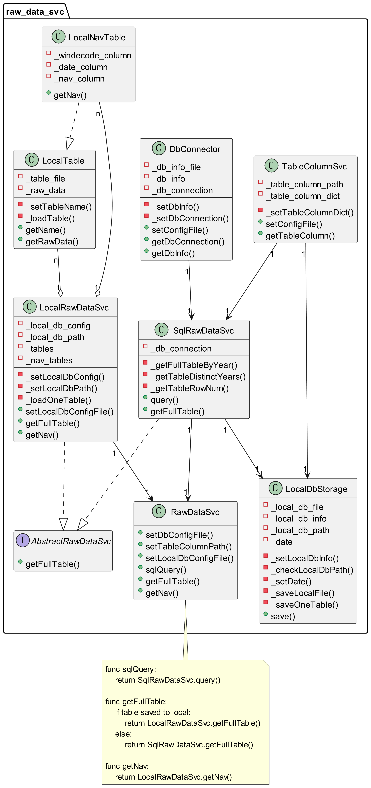
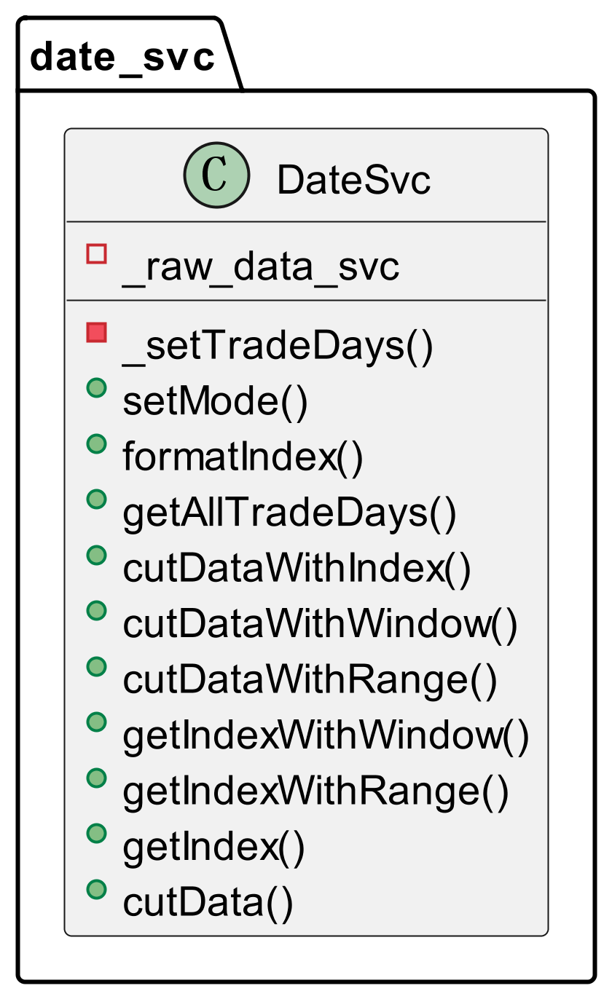

# framework/svc
将全局使用的一些工具封装成若干单例类，减少不必要的内存和时间消耗。

用户使用服务时，先从import_svc导入getSvc函数，该函数通过配置文件寻找svc的位置，用户使用时不需要通过路径寻找包的位置。

参考示例代码：https://github.com/yuansicheng/FOF_portfolio_toolbox/blob/master/examples/svc_examples.ipynb

## raw_data_svc
提供原始数据相关的接口。
 

1. python save_table_columns.py  

2. 选择需要的列名
上一步生成的yaml文件中，注释掉不需要的列。  
使用raw_data_svc读入整表时，只读取配置文件中的列名。

3. 下载数据到本地
python local_db_storage.py  
将配置文件local_db.yaml中tables设置的表下载到本地，本地数据库位置在local_db_loc字段。

## date_svc
提供日期相关操作的接口， 数据格式统一使用datetime.datetime。
 

## constant_svc
提供获取常数的服务，用户将常数存入yaml文件中，使用时可以通过getConstant接口或直接访问attr的方式获取常数。

## indicator_svc
封装quantstats中计算指标的函数，提供便捷的指标计算服务。
- 收益率
- 波动率
- sharpe
- sortino
- calmar

